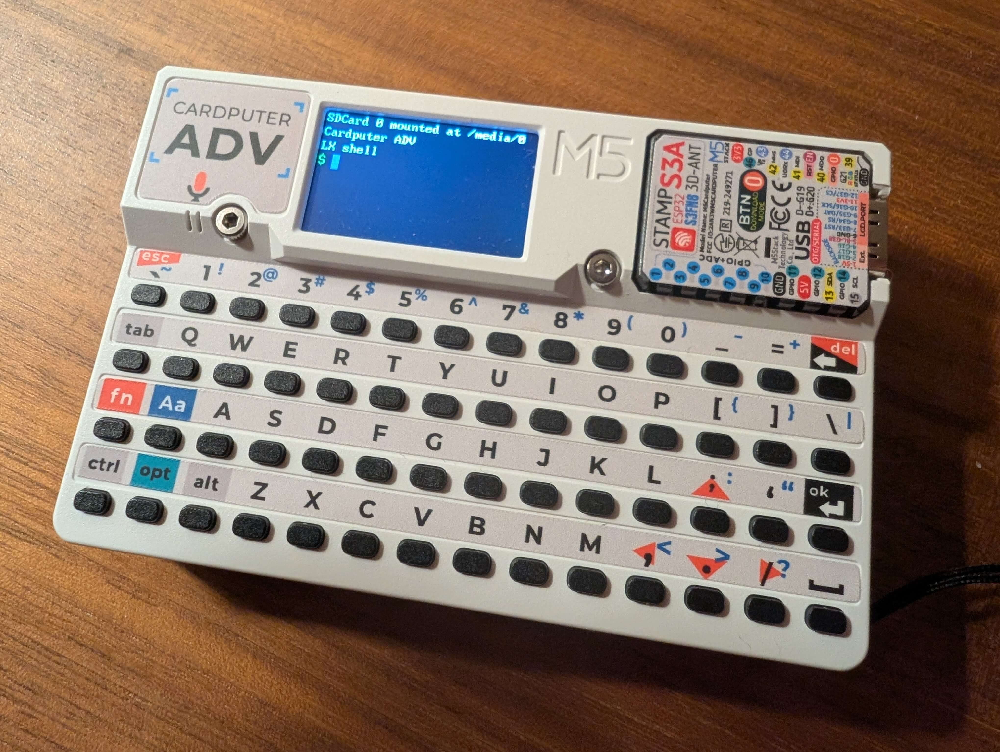

# Lx Shell for M5Stack Cardputer ADV

Minimal Unix‑like shell optimized for the **Cardputer ADV**.
Includes a terminal, a minimal vi (or nano) editor, core commands, and Lx script execution.



## Features

- Interactive terminal with history, autocompletion, and pager (`more`/`less`)
- Minimal vi and nano editors (navigation, insertion, indentation, visual wrapping)
- Core commands: `battery`, `cat`, `cd`, `cp`, `find`, `ls`, `mount`, `mv`, `rm`, `umount`
- Run Lx scripts (`lx <script.lx>`)
- Output redirection (`>`, `>>`), pipes (`|`), and `tee`
- Screensaver + display sleep
- Keyboard with CP437 extended glyphs and optional debug

## Commands

- [battery](commands/battery.md) - battery status
- [cat](commands/cat.md) - print file contents
- [cd](commands/cd.md) - change directory
- [clear](commands/clear.md) - clear terminal
- [cp](commands/cp.md) - copy file
- [find](commands/find.md) - search files
- [less](commands/less.md) - alias for `more`
- [ls](commands/ls.md) - list directory contents
- [lx](commands/lx.md) - run a Lx script
- [lxprofile](commands/lxprofile.md) - set Lx memory profile
- [man](commands/man.md) - command help
- [mkdir](commands/mkdir.md) - create directory
- [more](commands/more.md) - pager for files and output
- [mount](commands/mount.md) - mount SD card
- [mv](commands/mv.md) - move/rename file
- [nano](commands/nano.md) - minimal editor (nano-style)
- [pwd](commands/pwd.md) - print working directory
- [reset](commands/reset.md) - alias for `clear`
- [rm](commands/rm.md) - remove file
- [rmdir](commands/rmdir.md) - remove directory
- [shutdown](commands/shutdown.md) - halt or restart
- [tee](commands/tee.md) - write piped output to a file
- [touch](commands/touch.md) - create/update file
- [umount](commands/umount.md) - unmount SD card
- [vi](commands/vi.md) - minimal editor

## Target hardware

- M5Stack **Cardputer ADV** (ESP32‑S3)
- micro‑SD card for filesystem (`/media/0`)

## Build and flash (PlatformIO)

This project is built with [PlatformIO](https://platformio.org/).

1. Initialize submodules:

```bash
git submodule update --init --recursive
```

2. Build and upload:

```bash
pio run
pio run -t upload
```

3. Open serial monitor:

```bash
pio device monitor
```

## Quick usage

```sh
cd /media/0
ls
lx my_script.lx
lx scripts/lx_stress_test_progressive.lx > output.txt
```

## Shell behavior

- History lives in `/sdcard/.lx_history` on the SD card, loaded on boot and appended
  after each executed line. If the file is missing, history stays in memory only.
- Autocomplete uses `Tab` on the current token. The first token searches `/bin` and
  the current directory, while path tokens list entries from that path. If multiple
  matches exist, they are printed space-separated and the input line is restored.
- `lxprofile` is stored in RAM only; the default is `balanced` and it resets on reboot.

## Lx profiles

The Lx runtime supports memory profiles:

```sh
lxprofile
lxprofile safe|balanced|power
lx --profile power /media/0/my_script.lx
```

Profiles reserve a minimum amount of free heap to avoid hard OOM crashes.

- `safe`  : highest reserve, most conservative
- `balanced`: default reserve, good for most scripts
- `power`: lowest reserve, maximum capacity (higher OOM risk)

## Lx project (submodule)

The Lx engine is integrated as a **submodule** in `lib/lx`.

Upstream project: [github.com/ppyne/lx](https://github.com/ppyne/lx)

To update:

```bash
cd lib/lx
git fetch --tags
git checkout v1.3.0
```

## Extended glyphs (Opt key)

Hold `Opt` and press a key to cycle through extra CP437 glyphs. Each press moves
to the next glyph, and releasing `Opt` keeps the current one. UTF-8 input/output
is supported, but only glyphs that map to CP437 are rendered.

**Opt key mapping**

| Key | Cycle sequence | Key | Cycle sequence | Key | Cycle sequence |
| --- | --- | --- | --- | --- | --- |
| `,` | ≤<◄←, | `_` | ±+▬_ | `m` | µm |
| `.` | ≥>▼↓•◘∙·■. | `a` | àâæÆáäÄåŪαa | `n` | ñÑⁿ∩n |
| `/` | ¿?►→/ | `c` | çÇ¢c | `o` | ôöÖòóº°Ωo |
| `0` | °○◙☺︎☻☼♂♀0 | `d` | δd | `p` | ₧π¶p |
| `1` | ¡‼½¼♪♫↕↨1 | `e` | éÉèêëεe | `s` | ßσΣ§s |
| `2` | ²2 | `f` | ƒφΦf | `t` | τΘt |
| `8` | ÷∞8 | `g` | Γg | `u` | ùûüÜú∩u |
| `;` | ▲↑; | `i` | îïìí∞i | `v` | √♥♦♣♠v |
| `=` | ±≡≈÷= | `l` | £∟l | `y` | ÿ¥y |

**UTF-8 to CP437 rendered glyphs**

| Glyph | UTF-8 | CP437 | Glyph | UTF-8 | CP437 | Glyph | UTF-8 | CP437 |
| --- | --- | --- | --- | --- | --- | --- | --- | --- |
| ☺ | U+263A | 0x01 | û | U+00FB | 0x96 | ╠ | U+2560 | 0xCC |
| ☻ | U+263B | 0x02 | ù | U+00F9 | 0x97 | ═ | U+2550 | 0xCD |
| ♥ | U+2665 | 0x03 | ÿ | U+00FF | 0x98 | ╬ | U+256C | 0xCE |
| ♦ | U+2666 | 0x04 | Ö | U+00D6 | 0x99 | ╧ | U+2567 | 0xCF |
| ♣ | U+2663 | 0x05 | Ü | U+00DC | 0x9A | ╨ | U+2568 | 0xD0 |
| ♠ | U+2660 | 0x06 | ¢ | U+00A2 | 0x9B | ╤ | U+2564 | 0xD1 |
| • | U+2022 | 0x07 | £ | U+00A3 | 0x9C | ╥ | U+2565 | 0xD2 |
| ◘ | U+25D8 | 0x08 | ¥ | U+00A5 | 0x9D | ╙ | U+2559 | 0xD3 |
| ○ | U+25CB | 0x09 | ₧ | U+20A7 | 0x9E | ╘ | U+2558 | 0xD4 |
| ◙ | U+25D9 | 0x0A | ƒ | U+0192 | 0x9F | ╒ | U+2552 | 0xD5 |
| ♂ | U+2642 | 0x0B | á | U+00E1 | 0xA0 | ╓ | U+2553 | 0xD6 |
| ♀ | U+2640 | 0x0C | í | U+00ED | 0xA1 | ╫ | U+256B | 0xD7 |
| ♪ | U+266A | 0x0D | ó | U+00F3 | 0xA2 | ╪ | U+256A | 0xD8 |
| ♫ | U+266B | 0x0E | ú | U+00FA | 0xA3 | ┘ | U+2518 | 0xD9 |
| ☼ | U+263C | 0x0F | ñ | U+00F1 | 0xA4 | ┌ | U+250C | 0xDA |
| ► | U+25BA | 0x10 | Ñ | U+00D1 | 0xA5 | █ | U+2588 | 0xDB |
| ◄ | U+25C4 | 0x11 | ª | U+00AA | 0xA6 | ▄ | U+2584 | 0xDC |
| ↕ | U+2195 | 0x12 | º | U+00BA | 0xA7 | ▌ | U+258C | 0xDD |
| ‼ | U+203C | 0x13 | ¿ | U+00BF | 0xA8 | ▐ | U+2590 | 0xDE |
| ¶ | U+00B6 | 0x14 | ⌐ | U+2310 | 0xA9 | ▀ | U+2580 | 0xDF |
| § | U+00A7 | 0x15 | ¬ | U+00AC | 0xAA | α | U+03B1 | 0xE0 |
| ▬ | U+25AC | 0x16 | ½ | U+00BD | 0xAB | ß | U+00DF | 0xE1 |
| ↨ | U+21A8 | 0x17 | ¼ | U+00BC | 0xAC | Γ | U+0393 | 0xE2 |
| ↑ | U+2191 | 0x18 | ¡ | U+00A1 | 0xAD | π | U+03C0 | 0xE3 |
| ↓ | U+2193 | 0x19 | « | U+00AB | 0xAE | Σ | U+03A3 | 0xE4 |
| → | U+2192 | 0x1A | » | U+00BB | 0xAF | σ | U+03C3 | 0xE5 |
| ← | U+2190 | 0x1B | ░ | U+2591 | 0xB0 | µ | U+00B5 | 0xE6 |
| ∟ | U+221F | 0x1C | ▒ | U+2592 | 0xB1 | τ | U+03C4 | 0xE7 |
| ↔ | U+2194 | 0x1D | ▓ | U+2593 | 0xB2 | Φ | U+03A6 | 0xE8 |
| ▲ | U+25B2 | 0x1E | │ | U+2502 | 0xB3 | Θ | U+0398 | 0xE9 |
| ▼ | U+25BC | 0x1F | ┤ | U+2524 | 0xB4 | Ω | U+03A9 | 0xEA |
| ⌂ | U+2302 | 0x7F | ╡ | U+2561 | 0xB5 | Ω | U+2126 | 0xEA |
| Ç | U+00C7 | 0x80 | ╢ | U+2562 | 0xB6 | δ | U+03B4 | 0xEB |
| ü | U+00FC | 0x81 | ╖ | U+2556 | 0xB7 | ∞ | U+221E | 0xEC |
| é | U+00E9 | 0x82 | ╕ | U+2555 | 0xB8 | φ | U+03C6 | 0xED |
| â | U+00E2 | 0x83 | ╣ | U+2563 | 0xB9 | ε | U+03B5 | 0xEE |
| ä | U+00E4 | 0x84 | ║ | U+2551 | 0xBA | ∩ | U+2229 | 0xEF |
| à | U+00E0 | 0x85 | ╗ | U+2557 | 0xBB | ≡ | U+2261 | 0xF0 |
| å | U+00E5 | 0x86 | ╝ | U+255D | 0xBC | ± | U+00B1 | 0xF1 |
| ç | U+00E7 | 0x87 | ╜ | U+255C | 0xBD | ≥ | U+2265 | 0xF2 |
| ê | U+00EA | 0x88 | ╛ | U+255B | 0xBE | ≤ | U+2264 | 0xF3 |
| ë | U+00EB | 0x89 | ┐ | U+2510 | 0xBF | ⌠ | U+2320 | 0xF4 |
| è | U+00E8 | 0x8A | └ | U+2514 | 0xC0 | ⌡ | U+2321 | 0xF5 |
| ï | U+00EF | 0x8B | ┴ | U+2534 | 0xC1 | ÷ | U+00F7 | 0xF6 |
| î | U+00EE | 0x8C | ┬ | U+252C | 0xC2 | ≈ | U+2248 | 0xF7 |
| ì | U+00EC | 0x8D | ├ | U+251C | 0xC3 | ° | U+00B0 | 0xF8 |
| Ä | U+00C4 | 0x8E | ─ | U+2500 | 0xC4 | ∙ | U+2219 | 0xF9 |
| Å | U+00C5 | 0x8F | ┼ | U+253C | 0xC5 | · | U+00B7 | 0xFA |
| É | U+00C9 | 0x90 | ╞ | U+255E | 0xC6 | √ | U+221A | 0xFB |
| æ | U+00E6 | 0x91 | ╟ | U+255F | 0xC7 | ⁿ | U+207F | 0xFC |
| Æ | U+00C6 | 0x92 | ╚ | U+255A | 0xC8 | ² | U+00B2 | 0xFD |
| ô | U+00F4 | 0x93 | ╔ | U+2554 | 0xC9 | ■ | U+25A0 | 0xFE |
| ö | U+00F6 | 0x94 | ╩ | U+2569 | 0xCA |   | U+00A0 | 0xFF |
| ò | U+00F2 | 0x95 | ╦ | U+2566 | 0xCB |  |  |  |


## License

BSD 3-Clause License. See [`LICENSE`](LICENSE).
